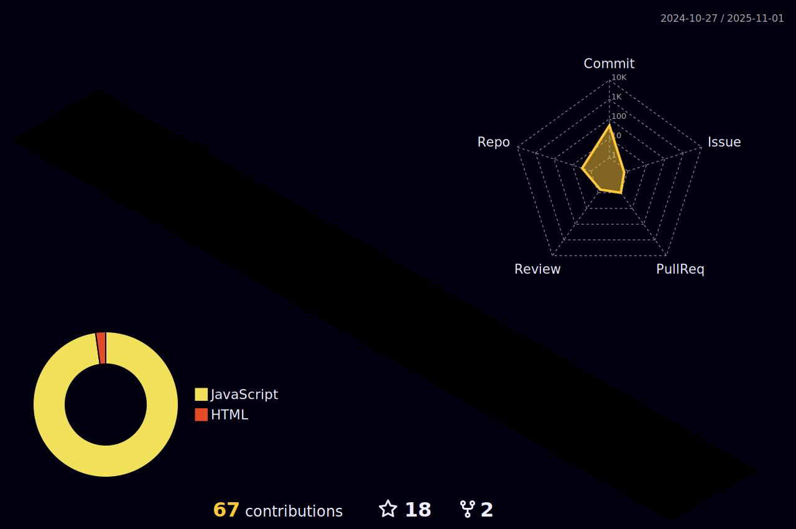

<h2 align="center">Hi 👋! I am Debdeep Banerjee</h2>

###

  
  
  
  
  
  
  
  
  
  
  
  
  
  
  
  
  
  
  
  
  
  
  
  
  
  
  
  
  
  
  
  
  
  
  
  
  
  
  
  
  
  
  
  
  
  
  

###

###

  
  
  

###

###

I'm an aspiring 🚀product manager, from India. 🎯I have worked as a project mentor and project admin in open-source events. 👨🏻‍💻I have also been an SDE intern in a mental health startup, working primarily on backend feature maintenance and development. As a freelancer, I have delivered several React-based web applications. That being said, I have another side to me!   🏆I have won State championship in basketball and have also played in a  🏀National tournament - All India Inter-Steel basketball championship, 2021.

###

###

  
  

###

 

###

  
  
  

###

  

###
